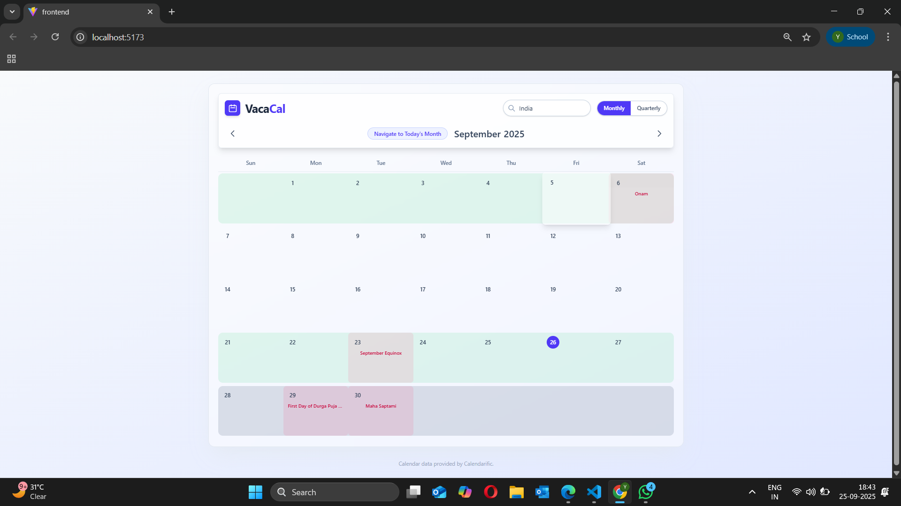
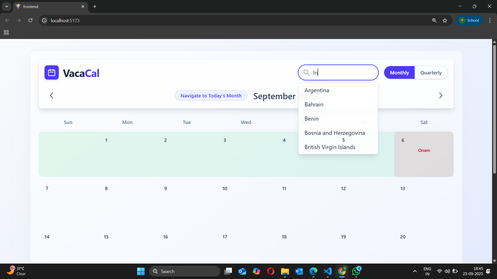
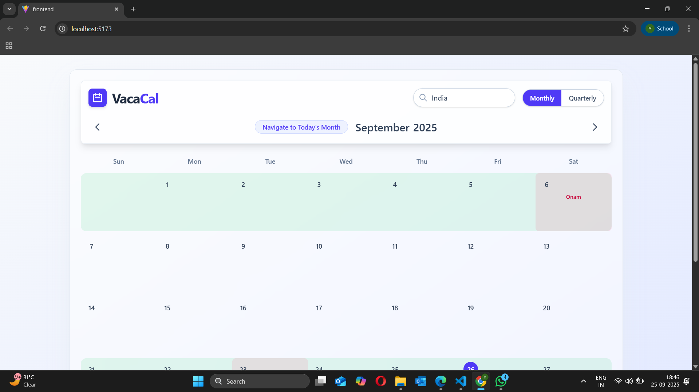
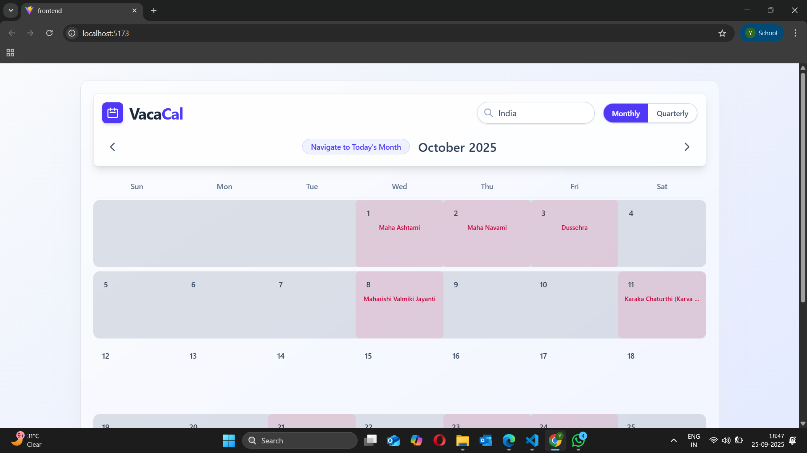
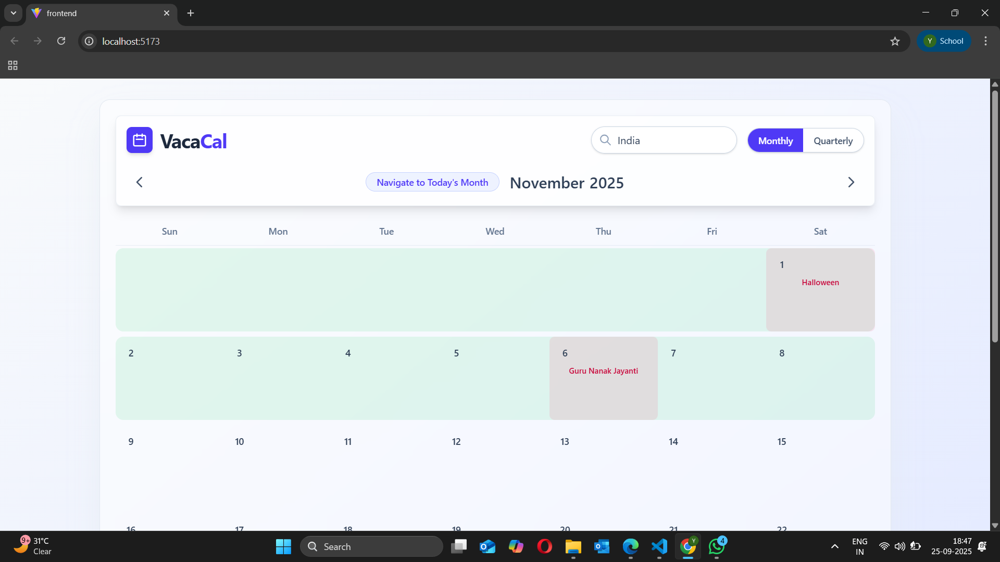
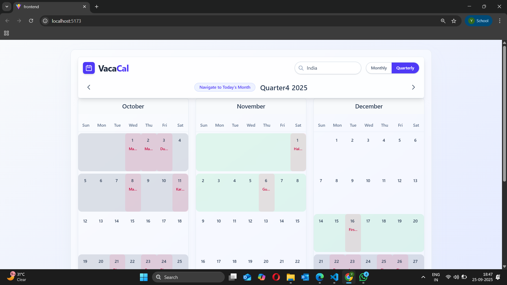
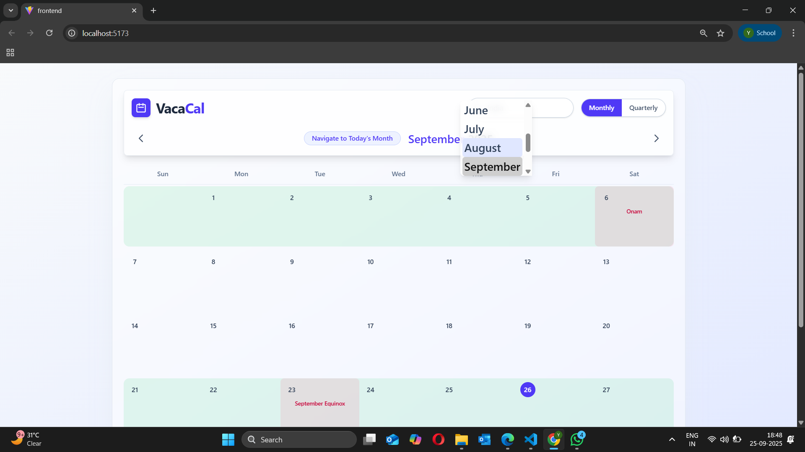
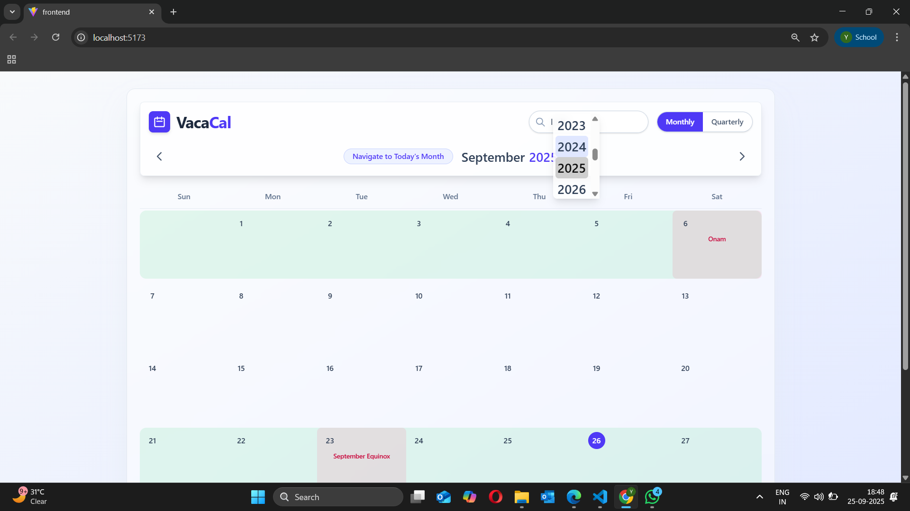
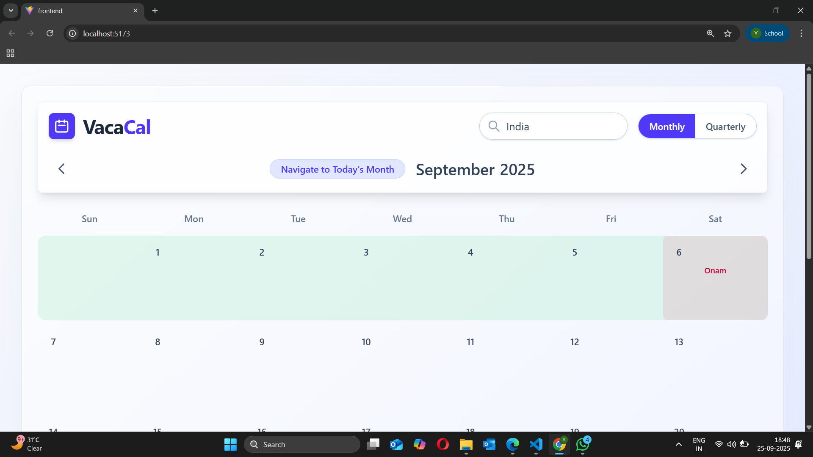

# Vacation Calendar - Full-Stack MERN Project

📖 About The Project

  This is a complete full-stack MERN (MongoDB, Express, React, Node.js) application that serves as a dynamic and feature-rich Vacation Calendar. The application fetches real-time public holiday data for countries around the world and presents it in a beautiful, intuitive, and highly interactive user interface. It was built to solve the challenge of easily visualizing holidays to better plan vacations and time off.

The primary features include smart week highlighting based on holiday density, multiple calendar views (monthly and quarterly), and full navigation controls for year, month, and country.

✨ Key Features

1. Dynamic Holiday Data:  Fetches real-time holiday information from the Calendarific API.

2. Monthly & Quarterly Views: Users can seamlessly switch between a detailed monthly view and a high-level quarterly overview.

3. Smart Week Highlighting:

     1. A week with a single holiday is highlighted in light green.
   
     2. A week with more than one holiday is highlighted in dark gray.
        

4. Full Navigation Controls:

    1. Navigate between months and years.

    2. Instantly jump to the current month with the "Today's Month" button.

    3. Hover-activated, scrollable dropdowns for both month and year selection.

5. Searchable Country Selector: A dynamic search bar allows users to find and select any country from a comprehensive list.

6. Responsive & Modern UI: A beautiful "glassmorphism" design that is fully responsive and looks great on all devices.

---
### 🛠️ Tech Stack

#### Frontend:
  
  1. React
  
  2. Vite
  
  3. Tailwind CSS

#### Backend:

  1. Node.js
  
  2. Express.js
  
#### API:

  1. Calendarific API for holiday data.

---
### 📸 Features in Detail & Screenshots
1. Main Calendar Interface
   
The main view is clean and modern, with a "glassmorphism" design that provides a beautiful backdrop for the calendar.

 
<!-- Upload a screenshot of the main calendar view (e.g., the current month for India) here. -->

2. Searchable Country Selector
   
Instead of a static dropdown, the user can search for any country. The list filters in real-time and shows the top 5 matches.

<!-- Upload a screenshot showing the country search dropdown with a search term like "United" and the filtered results below. -->

3. Smart Week & Day Highlighting
This is the core feature of the application, designed to make vacation planning effortless.

#### Single Holiday Week (Green Highlight):

<!-- Upload a screenshot of a week with a single holiday, highlighted in light green. -->

#### Multi-Holiday Week (Gray Highlight):

<!-- Upload a screenshot of a week with multiple holidays (e.g., during Christmas), highlighted in dark gray. -->

#### Individual Holiday Focus:

Each day that is a holiday is also given a distinct background color to make it stand out within the highlighted week. The holiday's name is clearly visible.

<!-- Upload a screenshot focusing on a single day that is a holiday, showing the darker background and the holiday name. -->

4. Comprehensive Navigation
#### Monthly vs. Quarterly View:

Users can instantly switch between views. The quarterly view label updates to show the correct quarter (e.g., "Quarter1", "Quarter2").

<!-- Upload a screenshot showing the "Quarterly" view active, with "Quarter3 2025" or similar displayed. -->

#### Month & Year Selection:

The navigation bar features hover-activated, scrollable dropdowns for both the month and year, keeping the UI clean while providing full control.

  
<!-- Upload a screenshot showing the user hovering over the year, with the scrollable year selection dropdown visible. -->

#### Navigate to Today's Month:

A convenient button allows the user to instantly return to the current month from anywhere in the calendar.

<!-- Upload a screenshot highlighting the "Navigate to Today's Month" button in the header. -->

---
### 🚀 Getting Started: Setup and Installation

To get a local copy up and running, follow these simple steps.

#### Prerequisites
    Node.js (v14 or later)
    
    npm
    
    Git

#### Backend Setup

1. Navigate to the backend directory:

    `cd backend`

2. Install NPM packages:

    `npm install`

3. Crucial Step: Get a free API key from Calendarific.

4. Open `backend/controllers/holidayController.js` and paste your API key into the `CALENDARIFIC_API_KEY` constant.

5. Start the backend server:

      `npm start`

6. The server will be running on http://localhost:5000.

#### Frontend Setup

1. Navigate to the frontend directory in a separate terminal:

   `cd frontend`

2.Install NPM packages:

    npm install

3.Start the Vite development server:

    npm run dev

4. Open your browser and go to the URL provided (usually http://localhost:5173).
